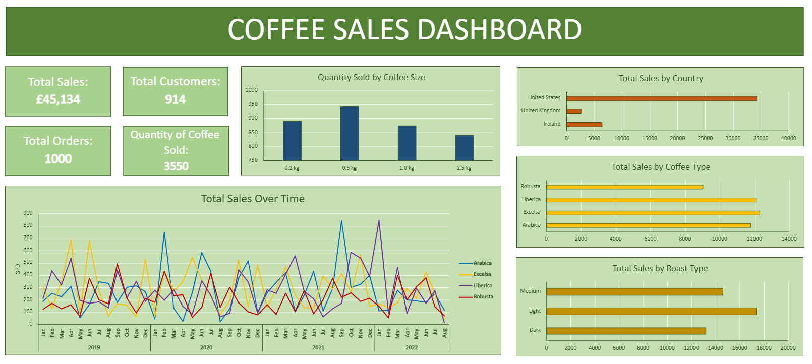
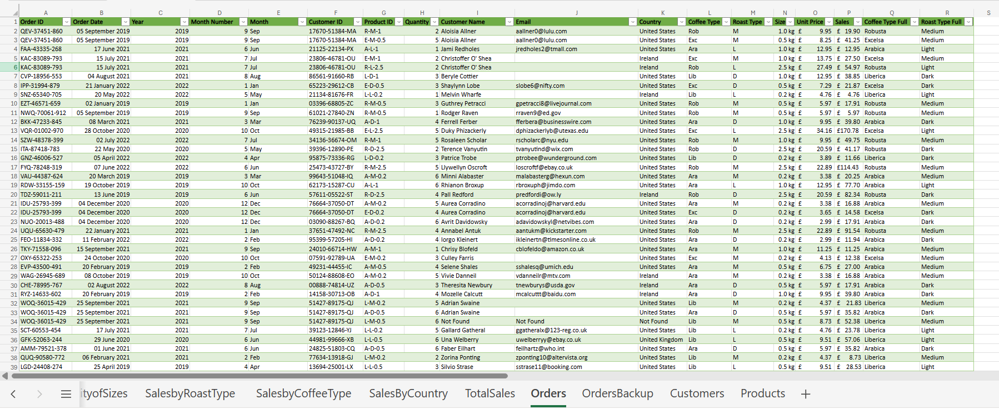

# Excel Coffee Sales  
#### Excel project demonstrating data cleaning, analysis, and dashboard creation to present sales trends about the companies products.

## Contents  
- [Purpose](#purpose)
- [Dashboard](#dashboard)
- [Objectives](#objectives)
- [Skills](#skills)
- [Challenges and Solutions](#challenges-and-solutions)
- [Key Insights](#key-insights)
- [Previews](#dashboard-preview)
  
## Purpose
I created this project to demonstrate my abilities in Excel, using the dataset on coffee sales.  

## Dashboard
I developed a dashboard that shows:  
  
  -Total Sales Over Time  
  -Total Sales by Roast Type  
  -Total Sales by Coffee Type   
  -Total Sales by Country  
  -Total Quantity Sold by Coffee Size  
    
and 4 KPIs including:
  
  -Total Sales  
  -Total Customers  
  -Total Orders  
  -Total Quantity of Coffee Sold  

## Objectives
The objectives of the project were to: visualise sales statistics, present total sales, highlight which roast types and coffee types produce the most sales, which countries generate the most sales, and which coffee size is most often purchased.  
Therefore, I'm able to highlight to the business which products give them the most sales; which coffee sizes, roast, and type the company should have a higher stock of, and where - as well as when - their sales are highest. 

## Skills 
Technical skills: XLOOKUP, INDEX and MATCH, IFS, Formatting, Pivot Tables, Charts, Dashboard design.  
Soft skills: Problem Solving by adapting to software limitations and using formula-based workarounds

## Challenges and Solutions
As I was using Excel for the web, unfortunately it doesn't support grouping in PivotTables, so I created Year and Month helper columns using the formulas =YEAR() and =MONTH(), and then inserted both columns into rows on the pivot table (Year above Month) in order to achieve the same result.  
As shown, I worked around feature limitations while maintaining dashboard functionality, and I'm also able to repeat this problem solving if similar issues arise in future projects.

## Key Insights
Key insights I gathered from the analysis were: 0.5kg coffee size is most purchased, the US produces the most revenue, light coffee is most desired, and the most popular coffee type is Excelsa whilst the least popular is Robusta.  
Furthermore, in a professional setting I would further investigate these to find out the reason why these results were produced, for example: I would hypothesise that the results from Total Sales by Coffee Type are due to the price of the Types rather than the popularity of them, so I'd add a bar chart for Total Quantity by Coffee Type to verify or deny this.

## Dashboard Preview

## Cleaned Table Preview

###### Excel sheet available in repository
###### Data used is artificial
